# Sala de Juegos Online

#### Materia: Laboratorio de Computación IV  
#### Alumno: Mateo Spatola  

---

## 1. Descripción del Proyecto  
La **Sala de Juegos Online** es una aplicación web interactiva que incluye una variedad de juegos clásicos y un juego propio llamado **Reflex**.  
El sistema permite a los usuarios registrarse, iniciar sesión, chatear y disfrutar de diferentes juegos diseñados para el entretenimiento y la habilidad.  

**Alojamiento:** Firebase (incluye autenticación y base de datos).  

---

## 2. Juegos Disponibles  
- **Ahorcado:** Descubre la palabra seleccionando letras. Información obtenida desde una API.  
- **Mayor o Menor:** Predice si la siguiente carta será mayor o menor. Mazo de cartas generado desde una API.  
- **Preguntados (Criptomonedas):** Responde preguntas sobre criptomonedas con datos de una API.  
- **Reflex (Propio):** Haz clic en círculos que disminuyen de tamaño antes de que desaparezcan.  

---

## 3. Funcionalidades Principales  
### Aplicación General:  
- **Registro y Autenticación:**  
  - Registro de nuevos usuarios con validación de datos.  
  - Inicio de sesión y restablecimiento de contraseñas.  
- **Sala de Juegos:**  
  - Navegación hacia los diferentes juegos.  
- **Chat:**  
  - Comunicación en tiempo real entre los usuarios registrados.  
- **Sección "Quién Soy":**  
  - Información personal y descripción detallada del juego Reflex.  

### Juegos:  
- **Ahorcado:**  
  - Juego clásico con interacción mediante botones.  
- **Mayor o Menor:**  
  - Juego simple basado en la predicción de cartas.  
- **Preguntados:**  
  - Juego de preguntas y respuestas sobre criptomonedas.  
- **Reflex:**  
  - Juego diseñado para evaluar rapidez y precisión.  

---

## 4. Imágenes Representativas  

### **Inicio**
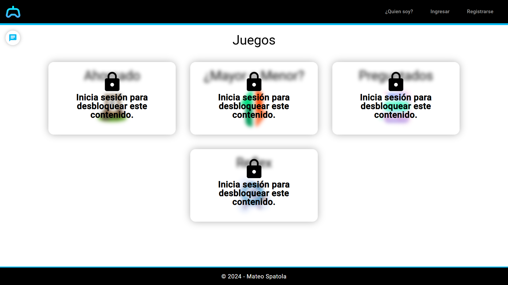  
Pantalla de inicio de la aplicación.  

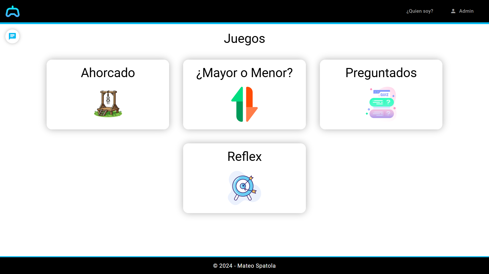  
Vista de la aplicación tras iniciar sesión.  

### **Ingreso y Registro**
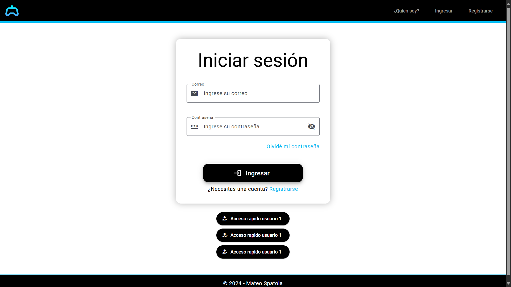  
Pantalla de inicio de sesión.  

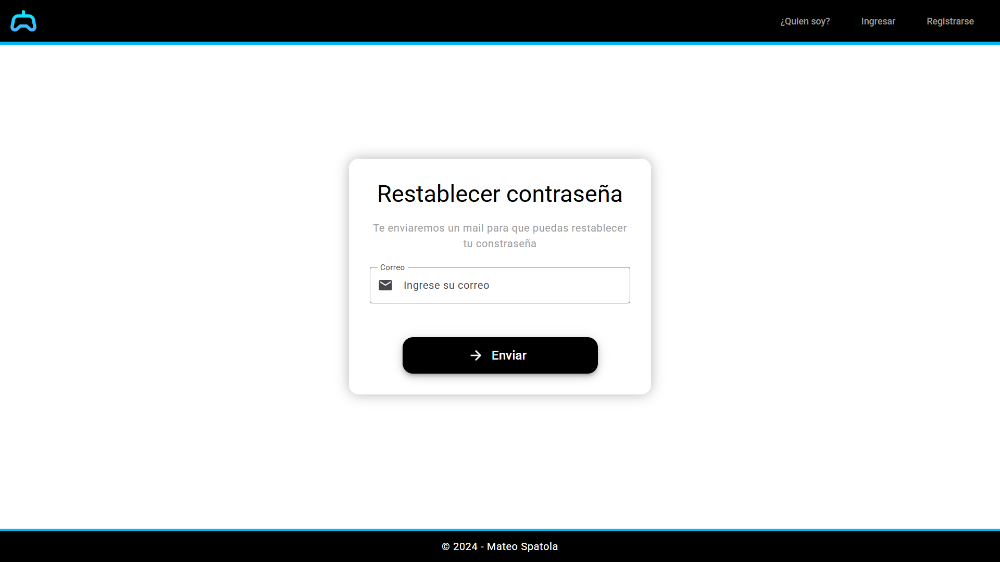  
Pantalla para restablecer la contraseña.  

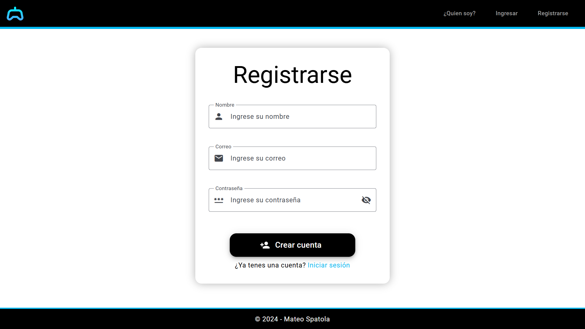  
Formulario de registro.  

### **Sección Quién Soy**
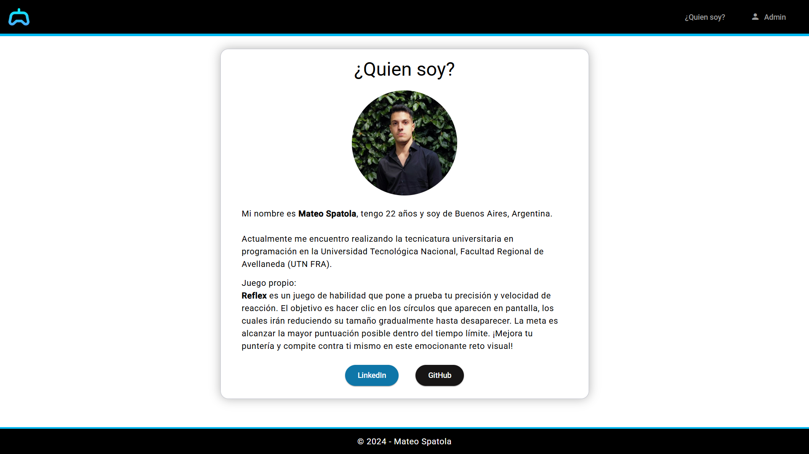  
Información sobre el desarrollador y el juego Reflex.  

### **Chat**
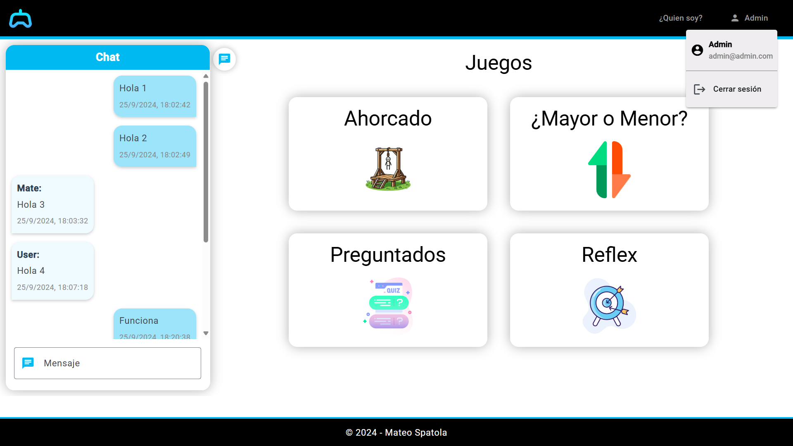  
Interfaz de chat entre usuarios.  

### **Juegos**
#### Ahorcado  
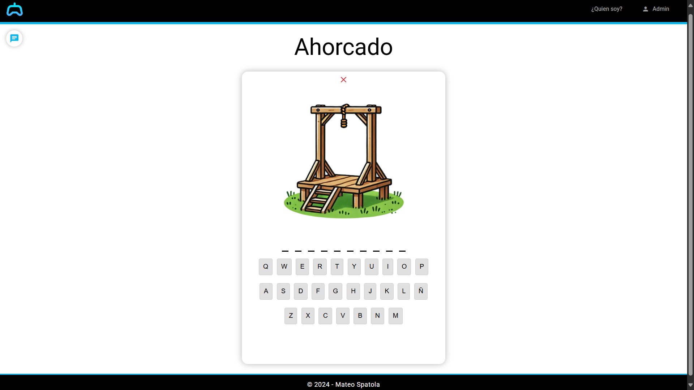  
Inicio del juego Ahorcado.  

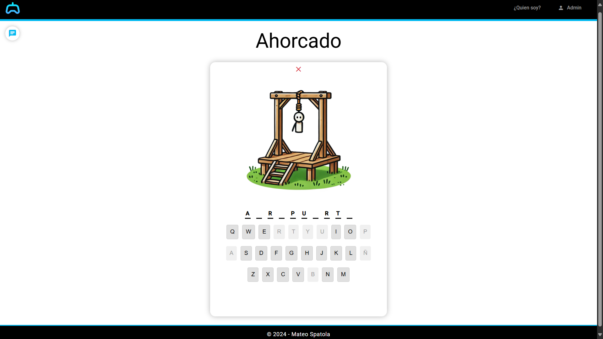  
Adivinando palabras.  

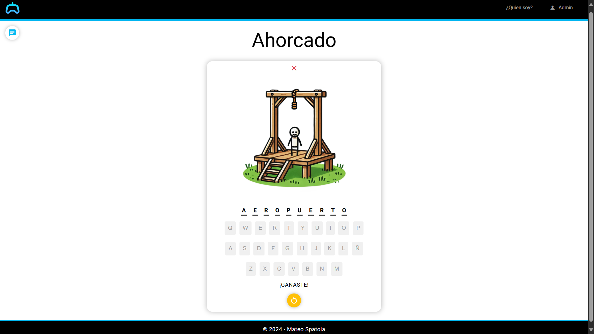  
Pantalla de victoria.  

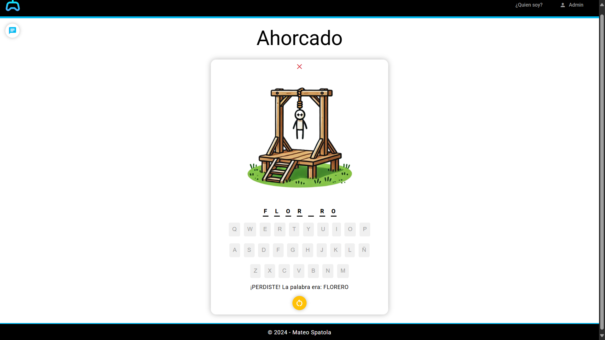  
Pantalla de derrota.  

#### Mayor o Menor  
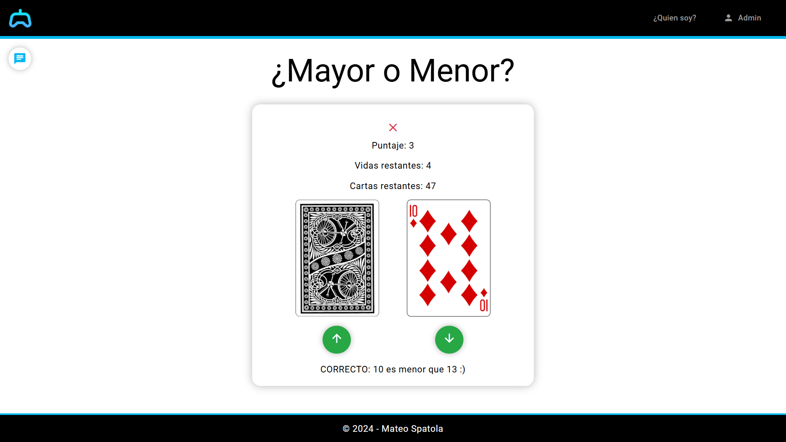  
Interfaz del juego Mayor o Menor.  

#### Preguntados  
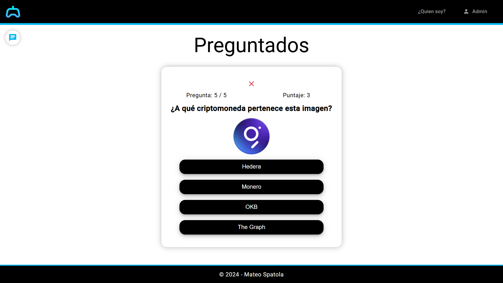  
Juego de Preguntados con temática de criptomonedas.  

#### Reflex  
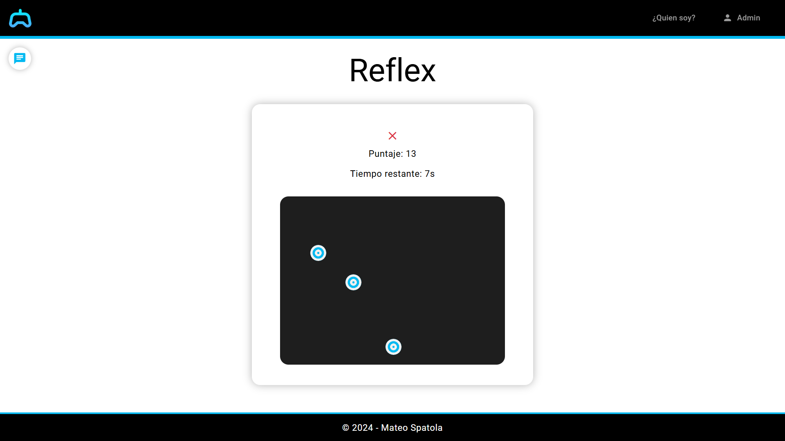  
Interfaz del juego Reflex.  

